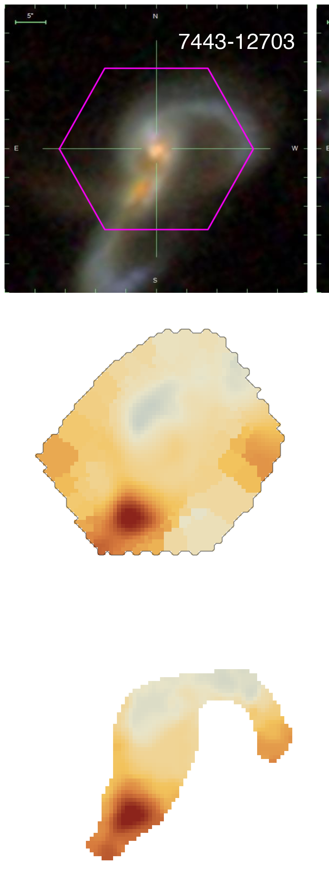

# Examples from `Geometry_astronomy`

These are the selected site assets copied out of the paper-material folders
and kept in a dedicated website asset directory.

## Toy-line comparison panels

## IFU kinematic comparison

