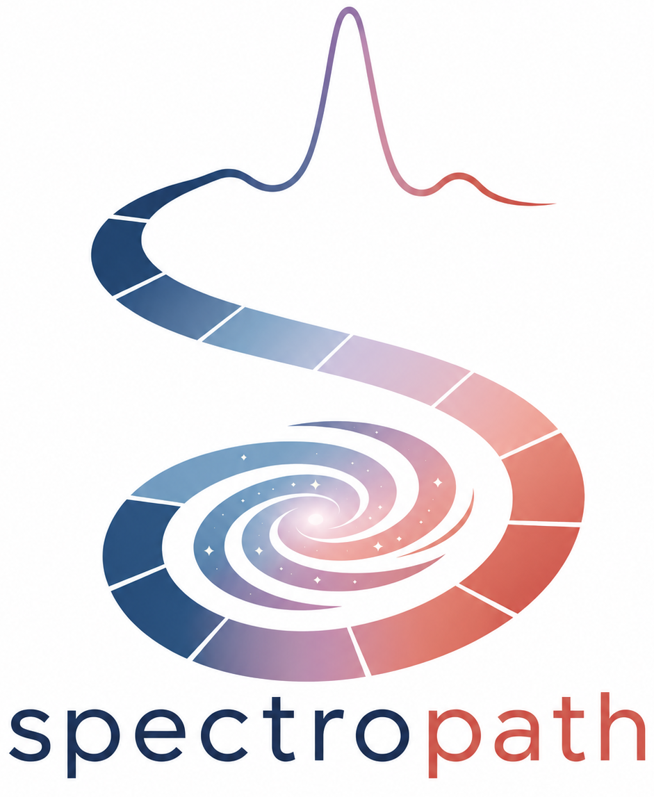
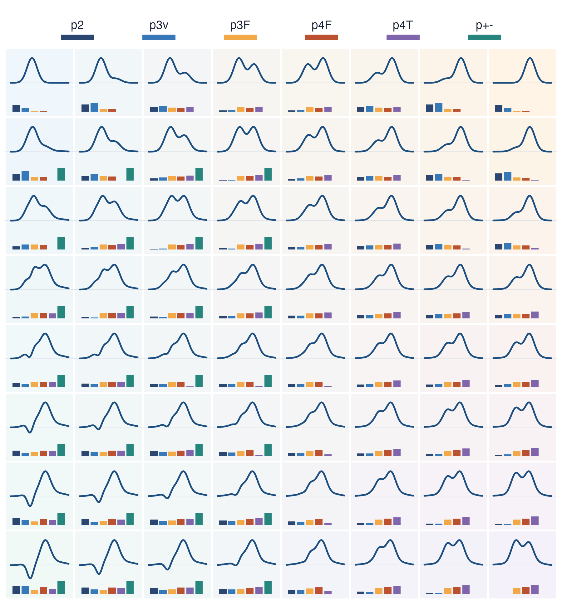
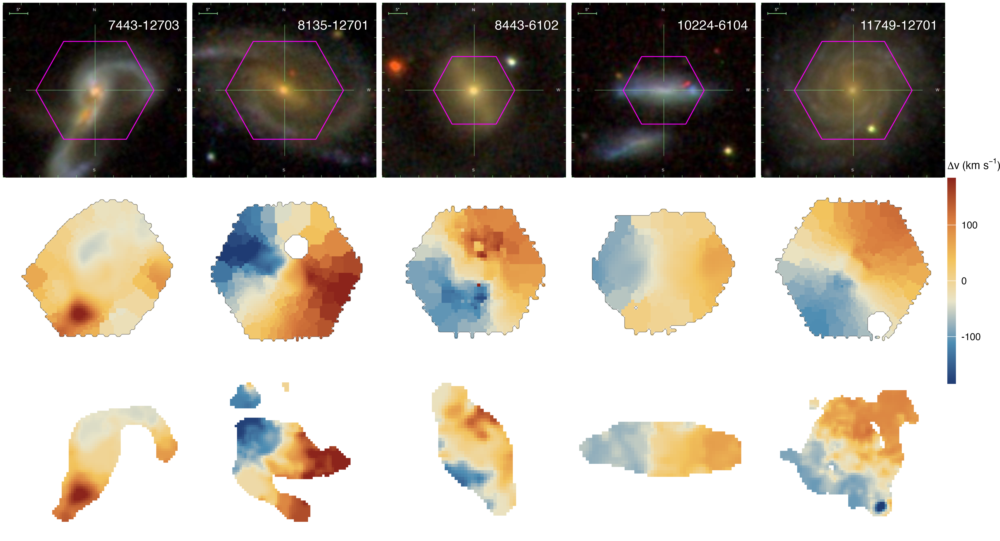

:::: {.home-shell}

:::: {.hero-grid #overview}

:::: {.hero-copy}

::: {.hero-logo}
{fig-alt="spectropath logo"}
:::

# spectropath {.sr-only}

Low-order path coordinates for spectral-line profiles. Build a path from an
ordered coordinate and a measured signal; spectropath returns the notation used
in the paper directly.

::: {.paper-meta}
Rafael S. de Souza · companion package for the path-signature line morphology paper
:::

::: {.inline-links}
[Python](python.html)
[Functions](reference.html)
[GitHub](https://github.com/RafaelSdeSouza/spectropath)
:::

::::

:::: {.code-card}

Minimal R workflow

```r
library(spectropath)

u <- seq(-5, 5, length.out = 500)
f <- dnorm(u, 0, 1) +
  0.25 * dnorm(u, 1.8, 0.45)
path <- cbind(u, f)

path_features(path)
```

```text
      p2   p_pm    p3u    p3F    p4F    p4T
 -0.3133 0.000 -0.0169 -0.1736 0.4534 0.0132
```

::::

::::

## Method {#method .section-heading}

::: {.method-panel}

`spectropath` provides tools for calculating low-order path-signature
coordinates of spectral-line profiles. These are summary statistics of
ordered paths, adapted here to line profiles of the form
`X(u) = (u, F(u))`, where `u` is wavelength or velocity and `F` is flux.

The returned coordinates describe ordered line morphology: signed area,
where asymmetry occurs, whether structure is concentrated in the core or the
wings, higher-order bends, and emission--absorption ordering. For convenience,
the package also estimates classical summaries such as line flux, equivalent
width, FWHM, `W80`, centroid, and skewness.

:::

## Astronomical applications {#figures .section-heading}

:::: {.feature-stack}

:::: {.feature-panel .feature-panel-atlas}


::: {.showcase-caption}
Line-profile morphology.
:::
::::

:::: {.feature-panel .feature-panel-ifu}


::: {.showcase-caption}
IFU kinematics.
:::
::::

::::

::::
