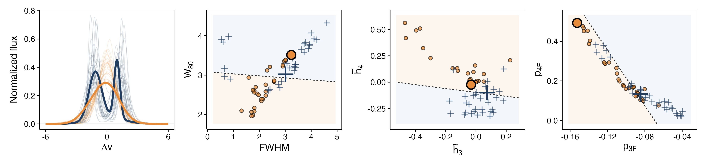
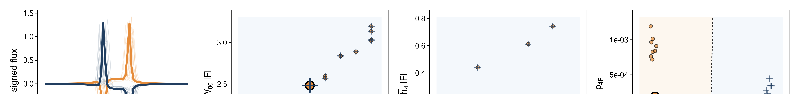
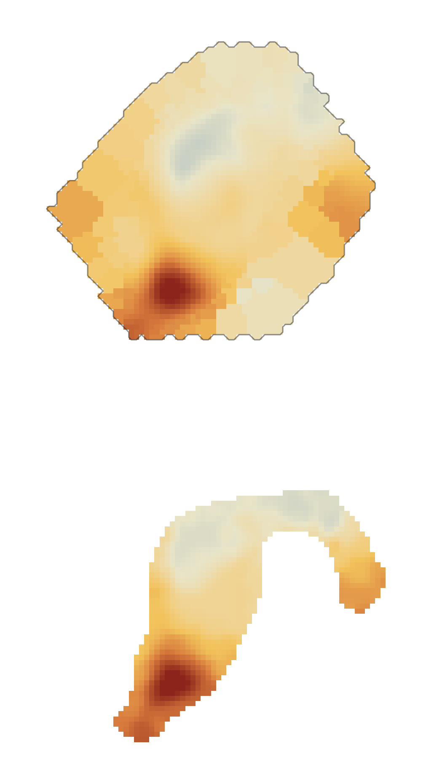

::: {.home-shell}
::: {.hero-grid}
::: {.hero-copy}
::: {.section-label}
Path-signature diagnostics for spectral-line morphology
:::

# spectropath {.hero-name}

`spectropath` is a small R package built around the notation used in the
paper. It treats a spectral profile as an ordered path \(X=(u,F)\) and
returns a compact set of low-order coordinates for asymmetry, core-versus-wing
structure, higher-order modulation, and emission--absorption ordering.

It is meant for the situations where line shape matters: blue and red wings,
shoulders, broad bases, double peaks, and mixed emission--absorption
structure.

::: {.inline-links}
[Quick start](#quick-start)  
[Examples](examples.html)  
[Reference](reference.html)  
[GitHub](https://github.com/RafaelSdeSouza/spectropath)
:::
:::

::: {.code-card}
Example

```r
library(spectropath)

u <- seq(-5, 5, length.out = 500)
f <- dnorm(u, 0, 1) + 0.25 * dnorm(u, 1.8, 0.45)
path <- cbind(u, f)

path_features(path)
```

```text
      p2   p_pm    p3u    p3F    p4F    p4T
 -0.3133 0.000 -0.0169 -0.1736 0.4534 0.0132
```
:::
:::

## Selected figures {.section-heading}

::: {.figure-grid}
::: {.image-card}


::: {.card-caption}
Toy line profiles used to compare classical and path-based descriptors.
:::
:::

::: {.image-card}


::: {.card-caption}
Mixed-sign profiles where emission--absorption ordering becomes relevant.
:::
:::

::: {.image-card}


::: {.card-caption}
Path-selected regions in an IFU cube, summarized as a compact kinematic map.
:::
:::
:::

## Paper notation {.section-heading}

::: {.notation-grid}
::: {.notation-item}
`p2`

Signed velocity--flux area.
:::

::: {.notation-item}
`p3u`

Location of asymmetry along the ordered coordinate.
:::

::: {.notation-item}
`p3F`

Whether asymmetry is concentrated in bright or faint parts of the line.
:::

::: {.notation-item}
`p4F`

Higher-order flux modulation.
:::

::: {.notation-item}
`p4T`

Twist-like higher-order structure.
:::

::: {.notation-item}
`p_pm`

Emission--absorption ordering.
:::
:::

## Quick start {#quick-start .section-heading}

::: {.quick-grid}
::: {.quick-card}
Install

```r
install.packages("remotes")
remotes::install_github("RafaelSdeSouza/spectropath")
library(spectropath)
```
:::

::: {.quick-card}
Compute

```r
u <- seq(-5, 5, length.out = 500)
f <- dnorm(u, 0, 1) + 0.25 * dnorm(u, 1.8, 0.45)
path <- cbind(u, f)

path_features(path)
classical_features(path)
```
:::
:::

For a larger set of paper figures and small reproducible examples, see the
[Examples](examples.html) page.
:::
