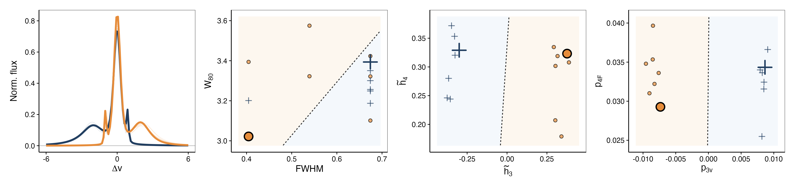
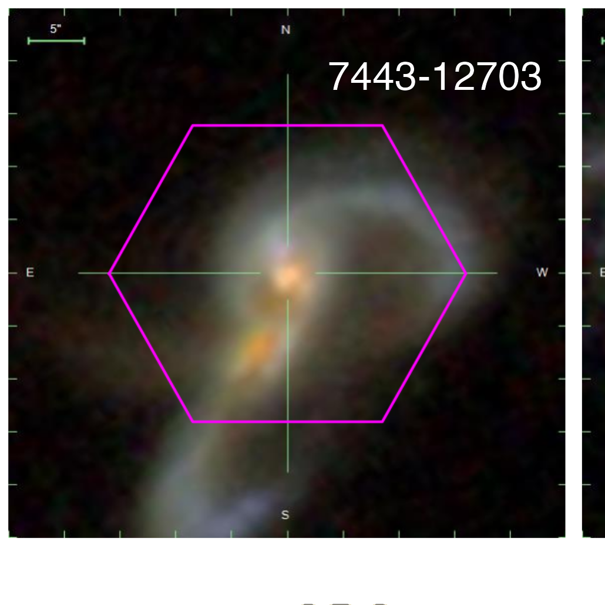
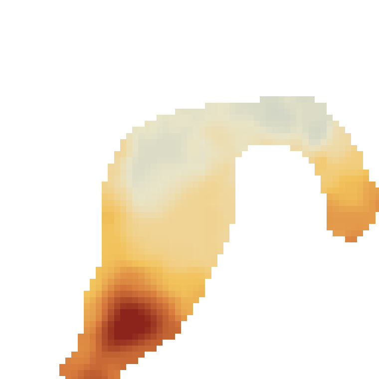

:::: {.home-shell}

:::: {.hero-grid}

:::: {.hero-copy}

<span class="section-label">Path signatures for spectral lines</span>

# spectropath {.hero-name}

Spectropath is a small R package for low-order path coordinates of
spectral-line profiles.

It follows the notation used in the paper and returns a compact path-based
summary of line shape.

::: {.inline-links}
[Quick start](#quick-start)
[Examples](examples.html)
[Python](python.html)
[Reference](reference.html)
[GitHub](https://github.com/RafaelSdeSouza/spectropath)
:::

::::

:::: {.code-card}

Minimal workflow

```r
library(spectropath)

u <- seq(-5, 5, length.out = 500)
f <- dnorm(u, 0, 1) + 0.25 * dnorm(u, 1.8, 0.45)
path <- cbind(u, f)

path_features(path)
```

```text
      p2   p_pm    p3u    p3F    p4F    p4T
 -0.3133 0.000 -0.0169 -0.1736 0.4534 0.0132
```

::::

::::

## Selected results {.section-heading}

:::: {.showcase-grid}

:::: {.showcase-lead}


::: {.showcase-caption}
Controlled profiles.
:::
::::

:::: {.showcase-side}
<div class="kinematics-pair">
  
  
</div>

::: {.showcase-caption}
IFU example.
:::
::::

::::

## Notation {.section-heading}

::: {.notation-strip}
`p2` `p3u` `p3F` `p4F` `p4T` `p_pm`
:::

## Quick start {#quick-start .section-heading}

:::: {.quick-grid}

:::: {.quick-card}

Install

```r
install.packages("remotes")
remotes::install_github("RafaelSdeSouza/spectropath")
library(spectropath)
```

::::

:::: {.quick-card}

Compute

```r
u <- seq(-5, 5, length.out = 500)
f <- dnorm(u, 0, 1) + 0.25 * dnorm(u, 1.8, 0.45)
path <- cbind(u, f)

path_features(path)
classical_features(path)
```

::::

::::

More examples live on the [Examples](examples.html) page.

::::
